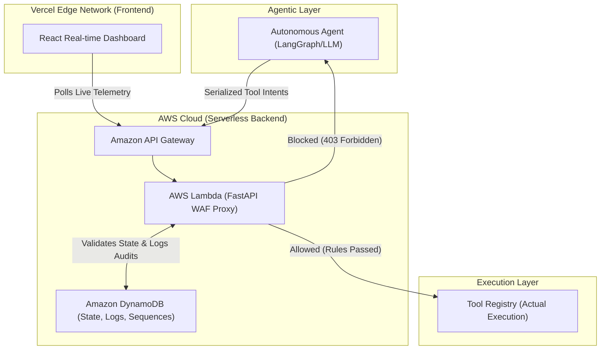

<div align="center">


# Agent WAF — The AI Agent Firewall

*A highly scalable, production-grade, policy-enforcing proxy between AI agents and their tools that transparently inspects, filters, and logs every tool invocation in real time.*

**🌐 Live Interactive Demo:** [https://agent-waf.pradeeshs.dev](https://agent-waf.pradeeshs.dev)


---

</div>

## 📖 The Problem Statement

As Autonomous AI Agents become increasingly capable of executing code, invoking tools, and modifying databases on behalf of users, the attack surface for organizations expands dramatically. 

Current Web Application Firewalls (WAFs) are built exclusively for traditional HTTP REST APIs. They rely on network-level heuristics (like IP rate-limiting or payload matching) and are completely blind to the intent and context of an AI agent's internal tool invocations. 

This leaves organizations exposed to new, AI-specific threats:
1. **Hallucinated Parameters:** Agents generating malformed or malicious arguments (e.g. SQL injections).
2. **Context Bleed:** Agents accessing or modifying data outside their authorized scope.
3. **Execution Errors:** Agents triggering tools out of order (e.g. attempting a refund before validating a user).
4. **Infinite Loops:** Agents getting stuck in a loop and spamming a downstream tool.

**The Solution:** We need an intent-aware security layer. A WAF built specifically for agents.

---

## 🚀 Core Features & Success Criteria

We successfully built a WAF proxy that acts as an impenetrable shield between an agent's "brain" (the LLM) and its "hands" (the Tool Execution Registry). It rigorously enforces 5 core hackathon success criteria:

### 1. Stateful Rate Limiting
- **The Threat:** An agent malfunctions and rapidly spams a downstream billing API.
- **The Defense:** Sliding window rate limiters dynamically track agent invocation counts in real-time. If an agent exceeds `max_calls` within a `window_seconds` timeframe, the WAF instantly cuts off access to that specific tool.

### 2. Parameter Validation & Blocklists
- **The Threat:** A Prompt Injection attack tricks the agent into passing a malicious SQL payload (`1 OR 1=1; DROP TABLE`) into a database lookup tool.
- **The Defense:** The WAF intercepts the parsed LLM arguments *before* execution, scanning them against a declarative regex blocklist in `policies.yaml` to neutralize injection payloads immediately.

### 3. Data Scope Enforcement
- **The Threat:** A customer service agent handles a request for User A, but accidentally queries the database for User B's highly sensitive financial records.
- **The Defense:** The WAF verifies the agent's declared scope (e.g. `['cust_123']`) against the actual arguments passed to the tool (`customer_id: cust_456`). If they mismatch, the execution is terminated.

### 4. Sequence Verification (State Machines)
- **The Threat:** An agent executes a destructive action (like a payment refund) without first executing the prerequisite verification tools.
- **The Defense:** The WAF maintains a persistent, session-based execution history for every agent. It evaluates sequence policies (e.g., *Tool B cannot be executed unless Tool A was executed in the current session*) and blocks out-of-order executions.

### 5. Shadow Mode (Enterprise Testing)
- **The Threat:** Security engineers want to deploy a strict new WAF rule, but fear it might break live agent workflows.
- **The Defense:** Setting `shadow: true` on a rule silently evaluates the traffic and logs the violation to the dashboard, but allows the traffic to pass anyway. This permits safe, zero-risk testing of new policies in a live production environment.

---

## ☁️ Architecture & Production Readiness

To maximize the **Production Readiness** criteria, we took this project beyond a simple localhost script. We engineered a highly scalable, decoupled, serverless architecture that can handle enterprise-scale agent traffic with zero idle costs.

### 1. AWS Serverless Backend (FastAPI + Mangum)
The core WAF proxy engine is written in Python (FastAPI). Instead of deploying it to a traditional, costly VM, we packaged it using AWS SAM and deployed it as an **AWS Lambda Function** exposed via an **Amazon API Gateway**. 
- **Benefit:** Infinite horizontal scaling. The WAF spins up in milliseconds to handle a burst of agent traffic, and spins down to $0.00 cost when idle.

### 2. Persistent State (Amazon DynamoDB)
A WAF is entirely dependent on its state memory (to track rate limits and sequences). We engineered a highly optimized Single-Table Design in **Amazon DynamoDB** to persist state across the ephemeral AWS Lambda invocations. 
- **Benefit:** Highly durable, lightning-fast reads/writes for sliding window counters, session sequences, and a permanent, searchable audit log of every intercepted tool call.

### 3. Hot-Reloading Declarative Policy Engine
Security policies are not hardcoded. They are declared in `policies.yaml`. The engine dynamically parses and enforces these rules on the fly, allowing security engineers to instantly adapt to new LLM threat vectors without deploying new code or restarting the WAF.

### 4. Real-Time Dashboard (React/Vite on Vercel)
We built a gorgeous, mobile-responsive, dark-mode React dashboard to monitor the telemetry of the WAF. 
- **Tech Stack:** React, Vite, Tailwind CSS, shadcn/ui.
- **Deployment:** Globally distributed on Vercel's Edge Network (`https://agent-waf.pradeeshs.dev`).
- **Features:** It dynamically polls the live AWS API Gateway, visualizing intercepts, traffic metrics, disposition outcomes, and rule evaluations in real time with high-precision absolute timestamps.

---

## 🏗️ Architecture Flow Diagram



---

## 💻 How to Run the Demo

Want to see the WAF intercepting traffic in real-time? You don't even need to spin up the backend—it's completely live in the AWS cloud!

### 1. View the Live Dashboard
Open the public frontend to watch the traffic stream in:
👉 **[https://agent-waf.pradeeshs.dev](https://agent-waf.pradeeshs.dev)**

### 2. Trigger Traffic from the Browser
On the live dashboard, simply click the **"Run Scripted Demo"** or **"Run Agentic Demo"** buttons! 
This will trigger a client-side runner (`demo-runner.ts`) that rapidly shoots HTTP POST payloads directly at the live AWS API Gateway to simulate an agent attempting malicious tool calls. Watch the dashboard light up instantly as the WAF intercepts the attacks!

### 3. Run the Scripted Agent Tests Locally
If you want to run the LangGraph simulation locally against the cloud API:

```bash
# 1. Clone the repository and enter the backend directory
git clone https://github.com/Pradeesh1108/agent-waf.git
cd agent-waf/agent-waf-backend

# 2. Set up the Python virtual environment
uv venv
source .venv/bin/activate
uv pip install -r requirements.txt

# 3. Run the demo against the live AWS WAF
PYTHONPATH=. python -m agents.demo --demo
```

---

## 👨‍💻 Contributors

- **Pradeesh S** - *Full Stack Architecture, AWS Serverless Engineering, WAF Rule Engine, and React UI Design.*
