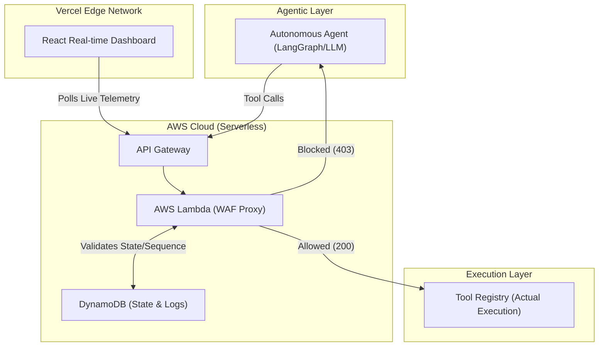

<div align="center">


# Agent WAF

*A production-grade, policy-enforcing proxy between AI agents and their tools that transparently inspects, filters, and logs every tool invocation in real time.*

**🌐 Live Demo:** [https://agent-waf.pradeeshs.dev](https://agent-waf.pradeeshs.dev)


---

</div>

## 📖 Problem Statement

AI Agents are rapidly gaining autonomy, capable of invoking tools, accessing databases, and performing actions on behalf of users. However, current Web Application Firewalls (WAFs) are built exclusively for traditional HTTP REST APIs. They rely on network-level heuristics (like IP rate-limiting or payload matching) and are completely blind to the intent and context of an AI agent's tool invocations. 

This leaves organizations without a robust, intent-aware security layer to verify if an agent is allowed to access specific data scopes, call tools in a specific sequence, or if they are executing dangerous, hallucinated parameters. 

## 🚀 Core Features (Hackathon Requirements)

We successfully implemented a fully functional WAF proxy that acts as an impenetrable shield between an agent's brain and its tools. It rigorously enforces 5 core success criteria:

- ✅ **Stateful Rate Limiting:** Prevents agents from endlessly looping or spamming APIs (e.g., *Agent may call Tool X no more than 3 times per 60 seconds*).
- ✅ **Parameter Validation & Blocklists:** Intercepts deeply nested, hallucinated, or malicious arguments (e.g., catching a `DROP TABLE` SQL injection payload embedded in an LLM query).
- ✅ **Data Scope Enforcement:** Strictly sandboxes agents to their authorized partitions (e.g., preventing an agent from looking up `cust_UNAUTHORIZED` when it only holds a token for `cust_123`).
- ✅ **Sequence Verification:** Enforces strict execution state machines (e.g., blocking `refund_payment` if the agent failed to execute `get_customer_record` first).
- ✅ **Shadow Mode:** A critical enterprise feature that silently evaluates traffic, logging violations without actively disrupting the agent's live execution (perfect for testing new rules!).

---

## ☁️ Production Readiness & Architecture

To maximize the **Production Readiness** criteria, we took this project beyond a simple localhost script and deployed a highly scalable, serverless architecture into the cloud.

### 1. AWS Serverless Backend
We packaged the FastAPI WAF engine using AWS SAM and deployed it entirely serverless using **AWS API Gateway** and **AWS Lambda**. This ensures the WAF proxy can handle thousands of concurrent agent requests effortlessly without ever paying for idle servers.

### 2. Persistent State with DynamoDB
A WAF is only as good as its memory. We migrated the in-memory array logs and sliding-window rate counters into a persistent **Amazon DynamoDB** NoSQL table. The WAF dynamically routes telemetry and session sequencing histories to the cloud, ensuring state survives across millions of Lambda invocations.

### 3. Hot-Reloading Policy Engine
Our `policies.yaml` rule engine was designed to be highly dynamic. Rules can be updated on the fly to instantly adapt to new LLM threat vectors without ever restarting the WAF or dropping active agent requests.

### 4. Real-Time Vercel Dashboard
We built a gorgeous, mobile-responsive dark-mode React dashboard to monitor the telemetry of the WAF. It is globally deployed on Vercel and dynamically polls the live AWS backend, visualizing intercepts, traffic metrics, and rule evaluations in real time.

---

## 🏗️ Architecture Diagram



---

## 💻 How to Run the Demo

Want to see the WAF intercepting traffic in real-time? You don't even need to spin up the backend—it's already live in the cloud!

### 1. View the Live Dashboard
Open the public frontend to watch the traffic stream in:
👉 **[https://agent-waf.pradeeshs.dev](https://agent-waf.pradeeshs.dev)**

### 2. Run the Scripted Agent Tests
Clone this repository and run the pre-built demo script that fires 5 distinct test cases (Rate limit, Parameter block, Scope breach, Sequence break, and Shadow mode) directly at the cloud API:

```bash
# 1. Enter the backend directory
cd agent-waf-backend

# 2. Run the demo against the live WAF
PYTHONPATH=. python -m agents.demo --demo
```

Watch your terminal and the live website dashboard to see the WAF intercept and block the malicious agent calls!

---

## 👨‍💻 Contributors

- **Pradeesh S** - *Architecture, Cloud Deployment & Frontend UI*
